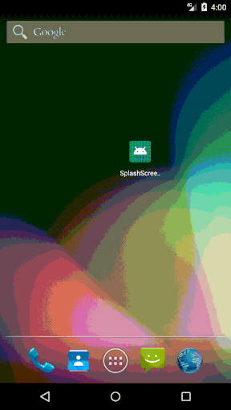

# Splash Screen

Hello, 
I have focused on the implementation of **Splash Screen** or **Welcome Screen**, in which you will also get to know 
how you can make a custom Spalsh Screen.

# What you will learn. 
- [x] Creating an Activity for Splash Screen, check *SplashScreenActivity*.

- [x] Creating a custom Style for Splash Screen, check *res->values->styles.xml*.

- [x] Creating a drawable file for Splash Screen Background using *layer-list*, check *res->drawable->splash_screen_background*.

- [x] Adding Image for SplashScreen in drawable folder with .png extension, check *res->drawable->sample_splashimage.png*.

- [x] Setting up theme style for *.SplashScreenActivity* in **AndroidManifest**  .

# Support :+1:  
[Instagram](https://www.instagram.com/amansharma.dev/)  

### Thank You!
